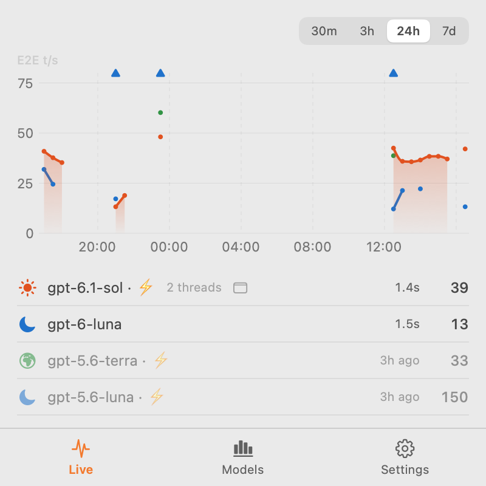
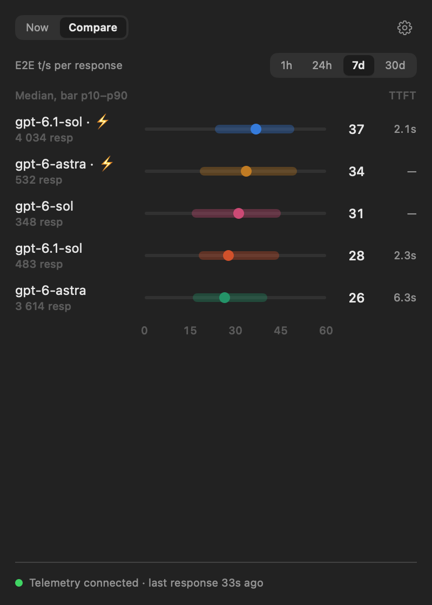

# CodexTPS

macOS menu bar app that shows how fast Codex models generate: output tokens per second for the Codex desktop app and CLI, with time to first token, per model and service tier.

<p>
  
  
</p>

- **Menu bar**: model and speed of one series, e.g. `⚡ 6.1-sol 50 t/s`: the pinned series, or else the one generating the most tokens lately, each response counting half as much for every 5 minutes of age (the same series the Live list starts with). A pin silent for an hour gives way while another series answers. A 1-minute token-weighted average by default, or 5 minutes, or the latest response. After 2 minutes without responses the value turns grey with its age (`6.1-sol 47 t/s · 12m`); after an hour only an icon remains. During a pause it keeps the last value instead of blanking.
- **Live**: a chart of the series over 30m / 3h / 24h / 7d (a few points far above the rest sit on the top edge as triangles, so they do not flatten the lines) and the series list: the menu bar series first, then the ones answering now, each with its 1-minute speed and TTFT. Hovering the chart switches the list to the series with a value at that moment; a click on a series pins it to the menu bar.
- **Models**: series ranked by median per-response speed over 1h / 24h / 7d / 30d, with a p10–p90 bar and median TTFT.
- **Settings**: E2E or decode speed, menu bar metric, split by reasoning effort, launch at login, Codex telemetry setup.

A series is a model × service tier: `–` default, `⚡` Fast (`fast` / `priority`), `⚡⚡` Ultrafast (`ultrafast`); other tiers show by name. Reasoning effort barely changes decode speed, so splitting series by it is optional.

Colors and marks follow the model family, whatever the version or tier: ✦ Astra violet, ☀ Sol orange, 🌍 Terra green, ☾ Luna blue, other models teal (SF Symbols in the app). Series of one family share the color and differ by name in the list.

CodexTPS is an independent project, not affiliated with, endorsed or sponsored by OpenAI.

## Install

Download `CodexTPS-<version>-macos-arm64.zip` from [Releases](https://github.com/strobil/CodexTPS/releases), unzip and move `CodexTPS.app` to `/Applications`. The app is ad-hoc signed, not notarized, so clear the quarantine flag once:

```sh
xattr -dr com.apple.quarantine /Applications/CodexTPS.app
```

Requires macOS 14 or later on Apple Silicon. Turn on **Launch at login** in Settings: responses made while CodexTPS is not running are not recorded.

## Setup

CodexTPS reads Codex's OpenTelemetry logs. On first launch it offers to add this to `~/.codex/config.toml` (or `$CODEX_HOME/config.toml`):

```toml
[otel]
exporter = { otlp-http = { endpoint = "http://127.0.0.1:43180/v1/logs", protocol = "json" } }
```

Nothing changes without confirmation. CodexTPS first backs the file up next to it (`config.toml.bak-codextps-…`), then writes it atomically and runs `codex features list`; if Codex rejects the file, the backup is restored. An `[otel]` section that already points elsewhere is left alone, since Codex has a single logs exporter.

Codex reads its config only at start. If the Codex app server was already running, CodexTPS offers **Restart Codex…**, which asks ChatGPT or Codex to quit and opens it again; terminal `codex` sessions need a manual restart. When telemetry needs attention, a status line appears above the tab bar and the Settings tab gets a dot; Settings always shows the telemetry state, and **Remove…** there takes the section out again.

The same steps work headless: `CodexTPS --setup-status`, `--setup-install`, `--setup-uninstall`.

## How it works

CodexTPS listens for OTLP/HTTP JSON on `127.0.0.1:43180` only. It pairs each request event (`codex.websocket_request`, or `codex.api_request` over HTTP) with the `codex.sse_event` `response.completed` of the same conversation that reports usage, which carries `ttft_ms`, output and reasoning tokens, model, reasoning effort and service tier. Telemetry has no request id, so a pair that contradicts Codex's TTFT or implies an implausible speed is dropped. Each response becomes one row in `~/Library/Application Support/CodexTPS/metrics.sqlite`; history starts when telemetry is turned on.

- **E2E** = output tokens / (request sent → response completed). Includes time to first token, so short answers look slower.
- **Decode** = (output tokens − 1) / (duration − TTFT): the generation speed itself.
- **TTFT** = time to first token, as measured by Codex.

Averages are token-weighted; Models uses per-response medians and percentiles. A series' figures cover the minute before its latest response, so they stay put during a pause. The popover has a fixed size because MenuBarExtra does not shrink its window while it is open.

## Build

Requires a Swift 6 toolchain.

```sh
./build.sh
open build/CodexTPS.app
```

For development:

- `CodexTPS --snapshot out.png [live|models|settings] [dark] [hover] [tray] [idle=<s>] [m30|h3|h24|d7|h1|d30]` renders the popover through an offscreen AppKit window and exits; the screenshots above come from it.
- `CodexTPS --bench [groups]` reports the load time and per-series totals.

## Releases

[release-please](https://github.com/googleapis/release-please) keeps a release PR open on `main` based on [Conventional Commits](https://www.conventionalcommits.org/) (`feat:` → minor, `fix:` → patch). Merging it tags the version, publishes a GitHub Release and attaches the built app zip with its SHA-256.
